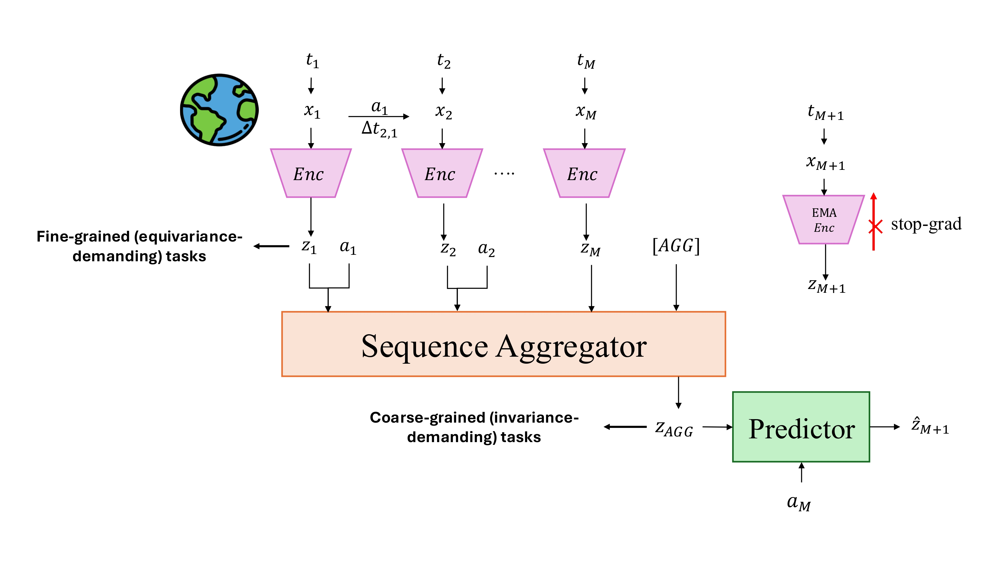

# seq-JEPA: Autoregressive Predictive Learning of Invariant-Equivariant World Models

<p align="center">
  <a href="https://openreview.net/forum?id=GKt3VRaCU1"></a>
  <a href="https://hafezgh.github.io/seq-jepa/"></a>
  <a href="https://huggingface.co/datasets/Hafez/salmap-stl10"></a>
  <a href="https://huggingface.co/datasets/Hafez/ImageNet1k-Saliency-Maps"></a>
  <a href="https://huggingface.co/datasets/Hafez/3DIEBench-OOD"></a>
</p>

## Overview

<p align="center">
  
</p>

## Pre-trained Checkpoints

Pre-trained seq-JEPA checkpoints for 3DIEBench and STL10 (PLS) are available on HuggingFace:

| Dataset | Checkpoint |
|---------|------------|
| 3DIEBench | [🤗 HuggingFace](https://huggingface.co/Hafez/seq-JEPA) |
| STL10 (PLS) | [🤗 HuggingFace](https://huggingface.co/Hafez/seq-JEPA) |

## Installation

```bash
# Clone the repository
git clone https://github.com/your-username/seq-jepa.git
cd seq-jepa

# Create environment (Python 3.10+)
conda create -n seqjepa python=3.10
conda activate seqjepa

# Install dependencies
pip install torch torchvision
pip install numpy scipy scikit-learn tqdm wandb
```

## Project Structure

```
seq-jepa/
├── src/
│   ├── main_transformed_views.py  # Training with transofrmed/augmented views (3DIEBench - CIFAR100 - TinyImageNet)
│   ├── main_pls.py                # Training with saliency-guided patches
│   ├── models.py                  # Model architectures
│   ├── engine.py                  # Training/evaluation loops
│   ├── datasets.py                # Dataset classes
│   ├── augmentations.py           # Parameterized augmentations
│   └── utils.py                   # Utilities
├── scripts/
│   ├── script_transformed_views.sh  # SLURM script for transforms
│   └── script_pls.sh                # SLURM script for PLS
├── data/
│   ├── 3DIEBench/                 # 3DIEBench index files and OOD dataset creation
│   ├── stl10/                     # STL10 saliency extraction
│   └── imagenet-1k/               # ImageNet saliency extraction
└── README.md
```

## Datasets

### 1. Transformed Views (3DIEBench, CIFAR100, TinyImageNet)

| Dataset | Description | Download |
|---------|-------------|----------|
| **3DIEBench** | 3D objects with controlled rotation/color | [SIE Repository](https://github.com/facebookresearch/SIE/tree/main/data) |
| **3DIEBench OOD** | OOD rotations (angles in [π/2, π] ∪ [-π, -π/2]) | [🤗 HuggingFace](https://huggingface.co/datasets/Hafez/3DIEBench-OOD) |
| **CIFAR100** | Natural images, 100 classes | Auto-download via torchvision |
| **TinyImageNet** | ImageNet subset, 200 classes | [Kaggle](https://www.kaggle.com/datasets/nikhilshingadiya/tinyimagenet200) |

### 2. Saliency-Guided Patches (STL10, ImageNet)

For predicitve learning across saccades (PLS) experiments:

| Dataset | Images | Saliency Maps |
|---------|--------|---------------|
| **STL10** | [Stanford](https://cs.stanford.edu/~acoates/stl10/) | [🤗 HuggingFace](https://huggingface.co/datasets/Hafez/salmap-stl10) |
| **ImageNet-1k** | [HuggingFace](https://huggingface.co/datasets/ILSVRC/imagenet-1k) | [🤗 HuggingFace](https://huggingface.co/datasets/Hafez/ImageNet1k-Saliency-Maps) |

## Training

### Transformed Views

Train seq-JEPA on 3DIEBench:

```bash
python src/main_transformed_views.py \
    --method seqjepa \
    --dataset 3diebench \
    --data-root /path/to/3DIEBench \
    --latent-type rot \
    --seq-len 3 \
    --img-size 128 \
    --batch-size 128 \
    --epochs 1000 \
    --lr 0.0004 \
    --ema --ema-decay 0.996 \
    --wandb
```

Train on CIFAR100:

```bash
python src/main_transformed_views.py \
    --method seqjepa \
    --dataset cifar100 \
    --data-root /path/to/cifar \
    --latent-type aug \
    --seq-len 3 \
    --img-size 32 \
    --cifar-resnet \
    --batch-size 256 \
    --epochs 2000 \
    --ema --ema-decay 0.996
```

### Predictive learning across saccades (PLS)

Train seq-JEPA with saliency-guided patches on STL10:

```bash
python src/main_pls.py \
    --method seqjepa \
    --dataset stl10 \
    --data-path-img /path/to/stl10 \
    --data-path-sal /path/to/salmap-stl10 \
    --num-saccades 5 \
    --fovea-size 32 \
    --img-size 96 \
    --use-sal 1 \
    --ior 1 \
    --cifar-resnet \
    --batch-size 512 \
    --epochs 2000 \
    --ema --ema-decay 0.996
```

### Multi-GPU Training

For distributed training across multiple GPUs:

```bash
torchrun --nproc_per_node=4 src/main_transformed_views.py \
    --distributed \
    --method seqjepa \
    --dataset 3diebench \
    --data-root /path/to/3DIEBench \
    ... # other args
```

## Supported Methods (seq-JEPA and baselines)

### Transformed Views (`main_transformed_views.py`)

| Method | Flag | 
|--------|------|
| **seq-JEPA** | `--method seqjepa` |
| SimCLR-EquiMod | `--method simclr-equimod` | 
| BYOL-Conditional | `--method byol-cond` |
| SEN | `--method sen` | 
| SIE | `--method sie` | 
| SimCLR | `--method simclr` | 
| BYOL | `--method byol` | 
| VICReg | `--method vicreg` | 
| VICReg-Traj | `--method vicreg-traj` | 

### PLS (`main_pls.py`)

| Method | Flag |
|--------|------|
| **seq-JEPA** | `--method seqjepa` | 
| Conv-IJEPA | `--method conv-ijepa` |

## Evaluation

### Linear Probing

To evaluate learned representations:

```bash
python src/main_transformed_views.py \
    --is-eval \
    --load-path /path/to/checkpoint.pth \
    --method seqjepa \
    --dataset 3diebench \
    --data-root /path/to/3DIEBench \
    --latent-type rot \
    --epochs 300
```

This trains linear probes for:
- **Classification**: Linear classifier on aggregate representation
- **Transformation prediction** (equivariance): Regressor for relative transformations


## Citation

```bibtex
@inproceedings{
ghaemi2025seqjepa,
title={seq-{JEPA}: Autoregressive Predictive Learning of Invariant-Equivariant World Models},
author={Hafez Ghaemi and Eilif Benjamin Muller and Shahab Bakhtiari},
booktitle={The Thirty-ninth Annual Conference on Neural Information Processing Systems},
year={2025},
url={https://openreview.net/forum?id=GKt3VRaCU1}
}
```